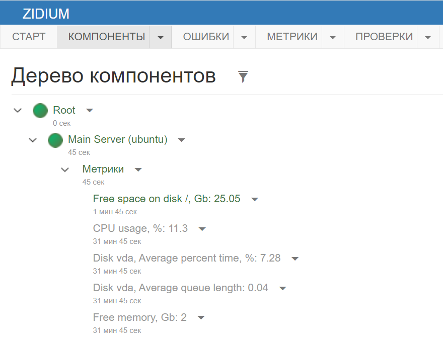
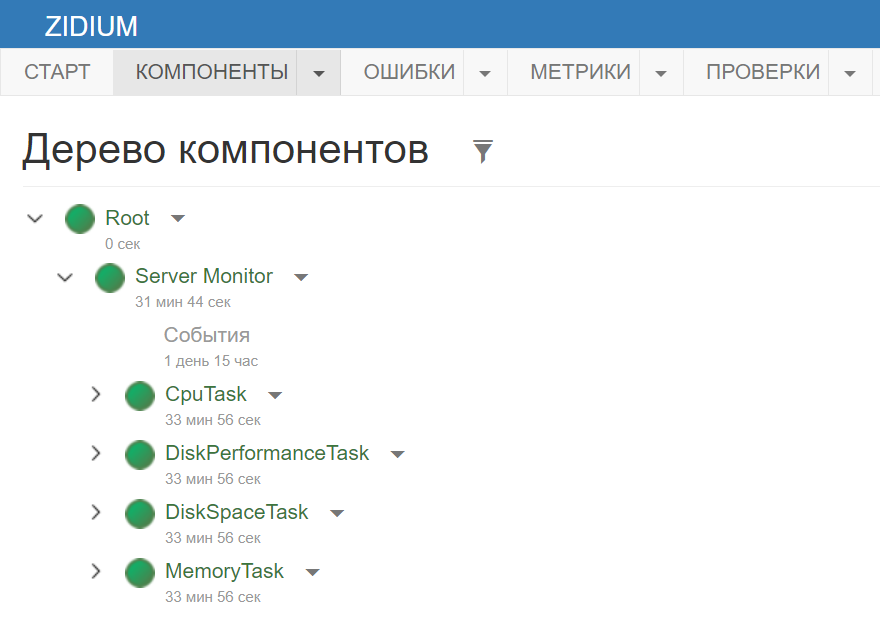

# Server Monitor
Приложение для мониторинга состояния сервера с помощью системы Zidium (http://zidium.net)

## Что это такое
Server Monitor - это приложение, написанное на .Net 6, которое собирает информацию о текущем состоянии вашего сервера и отправляет её в систему мониторинга Zidium.
Может работать как в режиме консольного приложения на любой совместимой ОС, так и в режиме Windows-службы.
Умеет отслеживать:
- Использование CPU
- Размер свободной памяти
- Количество свободного места на дисках
- Длину очереди дисков и процент загруженности

## Как настроить
Скачайте готовую сборку (https://github.com/Zidium/ServerMonitor/releases) или соберите из исходников сами, выполнив файл BuildRelease.bat. Релиз будет в папке Release.
Разместите релиз в папке на сервере.

Рядом с файлом appsettings.json создайте пустой файл appsettings.Production.json. 
Не редактируйте исходный файл appsettings.json! Он содержит примеры настроек и будет перезаписан в очередном обновлении.

В файле appsettings.Production.json в разделе Zidium/Access укажите адрес вашего сервиса Zidium и секретный ключ.
Секретный ключ можно получить в личном кабинете в разделе "Ключи доступа к Api".
Если вы хотите также мониторить работу и самого приложения Server Monitor, то создайте в личном кабинете для него компонент и укажите Id этого компонента в параметре Zidium/DefaultComponent.

В параметре Server/ComponentId укажите Id компонента, который представляет ваш сервер. Если такого компонента ещё нет, создайте его в личном кабинете.

В параметре Tasks/DiskSpaceTask/Disks укажите названия дисков, для которых вы хотите проверять свободное место.
Для Windows это буквы логических дисков, например "C".
Для Linux это точки монтирования дисков, например "/" или "/mnt/data". 

В параметре Tasks/DiskPerformanceTask/Disks укажите названия дисков, для которых вы хотите собирать данные производительности.
Для Windows это названия счётчиков производительности, например "0 C:", их можно получить, выполнив в powershell команду `Get-WmiObject -Query "select Name from win32_perfformatteddata_perfdisk_physicaldisk"`.
Для Linux это названия дисков, например "sda", их можно получить командой lsblk, столбец NAME.

Пример файла appsettings.Production.json:
```
{
  "Zidium": {
    "Access": {
      "Url": "http://localhost:60000",
      "SecretKey": "xxx"
    },
    "DefaultComponent": {
      "Id": "84010000-5e28-1901-30b4-3aea985fac50"
    }
  },

  "Server": {
    "ComponentId": "84010000-5e28-168a-d697-bb6c7f70e2e1"
  },

  "Tasks": {
    "DiskSpaceTask": {
      "Disks": [ "C" ]
    },
    "DiskPerformanceTask": {
      "Disks": [ "0 C:" ]
    }
  }
}
```

## Как запустить в Windows
Для запуска в режиме консольного приложения запустите ZidiumServerMonitor.exe
Для запуска в режиме службы зарегистрируйте службу командой `sc create ZidiumServerMonitor DisplayName="Zidium Server Monitor" binpath="<FullPath>\ZidiumServerMonitor.exe"`.
Далее службу можно настроить и запустить стандартными средствами Windows.

## Как запустить в Linux
Для запуска в режиме консольного приложения используйте команду `dotnet ZidiumServerMonitor.dll`.
Для запуска в режиме демона systemd:
- Укажите в файле zidium-server-monitor.service полный путь к ZidiumServerMonitor.dll (в параметре WorkingDirectory)
- Скопируйте файл в папку `/etc/systemd/system/`
- Выполните `sudo systemctl daemon-reload`
- Выполните `sudo systemctl start zidium-server-monitor`

Для сбора информации о производительности дисков нужно установить пакет sysstat.

## Что я увижу в итоге
В компоненте сервера появятся настроенные метрики:


Чтобы получать оповещения о нештатных ситуациях, настройте для метрик правила.

Если вы заполнили параметр defaultComponent, то в компоненте самого приложения появятся дочерние компоненты задач с проверками:


## Логирование
На Windows логи пишутся в папку `%localappdata%\ZidiumServerMonitor`, а также в сам Zidium. Файлы настроены на автоудаление через 30 дней.
Если приложение запущено в Windows в режиме службы и под системной учётной записью, то логи будут в папке `%SystemRoot%\System32\config\systemprofile\AppData\Local\ZidiumServerMonitor`.
На Linux логи пишутся в папку `~/.local/share/ZidiumServerMonitor`.
Все настройки логирования можно поменять в appsettings.Production.json в разделах Logging и NLog.
Если нужно только сменить путь, то достаточно поменять параметр NLog/variables/logPath.